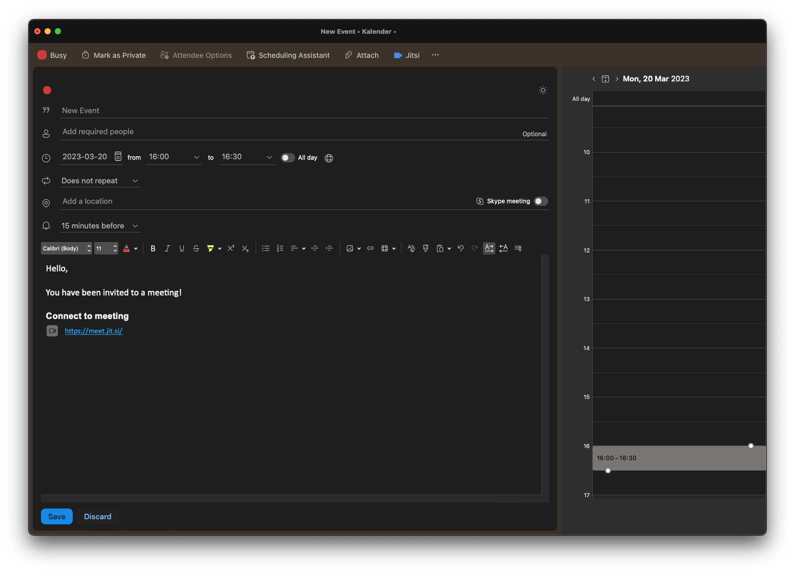

# **Jitsi Outlook add-in**

This Outlook add-in adds a randomly generated Jitsi link to an appointment (while in the appointment creation window). It was built based on the Yeoman generator, as described in the this [guide](https://learn.microsoft.com/en-us/office/dev/add-ins/quickstarts/outlook-quickstart?tabs=yeomangenerator).



## **Configuration**

This section describes how the add-in should and can be configured.

### `config.json`

The add-in can be configured through the use of a configuration file (named `config.json`), that should be placed in the root directory. The following is an example of how the configuration file could look like:

```
{
    "baseUrl": "https://my-jitsi-instance-url",
    "additionalText": "Some additional text beneath the signature",
}
```

All of the properties listed below can also be added to enable/disable any extra features.

| **Property**          | **Type** | **Description**                                                                   |
| --------------------- | -------- | --------------------------------------------------------------------------------- |
| `baseUrl`             | string   | Base url to your Jitsi instance.                                                  |
| `additionalText`      | string   | This text will show up at the bottom of the email signature.                      |
| `startWithAudioMuted` | boolean  | This forces the mic to be muted for every person entering the meeting.            |
| `startWithVideoMuted` | boolean  | This forces the camera to be disabled for every person entering the meeting.      |
| `disableInitialGUM`   | boolean  | Skips the initial permission check and configuration screen (GUM = getUserMedia). |

> Note that configuration is entirely optional and that Jitsi's default configuration will be used as a default if no configuration file is found in the project. The add-in will default to https://meet.jit.si if no configuration file is found.

### `manifest.xml`

The `manifest.xml` file found in the root directory is the core of the add-in. This file contains the specification, points of entry, used methods and assets that the add-in should use. It is through this file that Outlook knows where to find the relevant assets in the project. In order to run this add-in you will need to add some urls that are specific for your use case, these places in the file are highlighted with three variables as shown below:

- `PROVIDER_NAME`: The name of the company providing the add-in (could be your company).
- `PROJECT_BASE_URL`: Url pointing to where your add-in app is hosted.
- `SUPPORT_URL`: Support url to the add-in admin.

## **Installation and setup**

Thereafter, all the dependencies need to be installed:

```
npm install
```

## **Installing the add-in on your Outlook**

The add-in needs to be added to the relevant Outlook environment. The methods to do this are described in this section.

### **Adding the add-in to the Outlook tasbar**

The `manifest.xml` can be added as an add-in manually, through Outlooks add-in portal:

1. Open Outlook
2. Click the "..." button on the toolbar
3. Select "Get Add-ins"
4. Click on the "My add-ins" alternative on the left side menu
5. Click on the "Add a custom add-in" dropdown in the bottom section
6. Select the relevant alternative for where your manifest file is stored
7. Add the `manifest.xml` file and let it validate and load

When it has finished loading the add-in should be visible in the toolbar whenever you have the event organizer window open. I.e. when you are trying to organize and invite people to meeting.

### **Running the development server locally**

You can run and test the add-in code by running the following npm command:

```
npm run dev-server
```

This will start the local development server on port 3000. If the aforementioned `manifest.xml` variables have been set to your local machine you will be able to run the add-in locally.

### **Publishing the add-in**

This project does not provide a hosting or publishing recommendation, this is entirely up to the individual(s) using it. Microsoft provides a comprehensive publishing guide and provides different options in the following [link](https://learn.microsoft.com/en-us/office/dev/add-ins/publish/publish).
